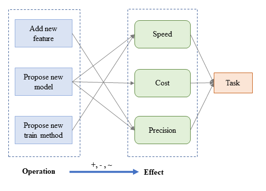
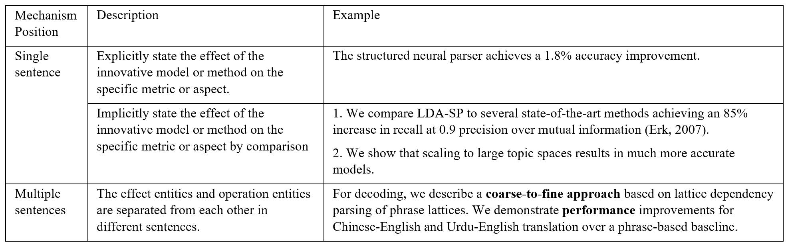
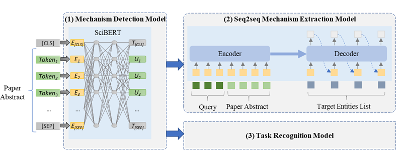

# The code and data for extracting metric-driven mechanism in scientific abstract

Abstract:

In response to the exponential growth of the volume of scientific publications, researchers have proposed a multitude of information extraction methods for extracting entities and relations, such as task, dataset, metric, and method entities. However, the existing methods cannot directly provide readers with procedural scientific information that demonstrates the path to the problem’s solution. From the perspective of applied science, we propose a novel schema for the applied AI community, namely a metric-driven mechanism schema (Operation, Effect, Direction). Our schema depicts the procedural scientific information concerning “How to optimize the quantitative metrics for a specific task?” In this paper, we choose papers in the domain of NLP for our study, which is a representative branch of Artificial Intelligence (AI). Specifically, we first construct a dataset that covers the metric-driven mechanisms in single and multiple sentences. Then we propose a framework for extracting metric-driven mechanisms, which includes three sub-models: 1) a mechanism detection model, 2) a query-guided seq2seq mechanism extraction model, and 3) a task recognition model. Finally, a metric-driven mechanism knowledge graph, named MKG_{NLP}, is constructed. Our MKG_{NLP} has over 43K n-ary mechanism relations in the form of (Operation, Effect, Direction, Task). The human evaluation shows that the extracted metric-driven mechanisms in MKG_{NLP} achieve 81.4% accuracy. Our model also shows the potential for creating applications to assist applied AI scientists to solve specific problems.

## Metric-driven mechanism schema

The Operation refers to a paper’s innovative algorithm, model, and method. The Effect refers to the metrics evaluating the operation’s efficiency and performance. The symbols +, − , ∼ between operation and effect refer to the change Direction types of Effect entity. Here, we divide direction into three categories: positive, negative, and other.

According to the range of metric-driven mechanism texts, the metric-driven mechanism in the abstract includes two expression types: 1) existing in a single sentence; and 2) existing in multiple sentences

## The metric-driven mechanism extraction framework.

(1): The mechanism detection model can filter papers that lack the metric-driven mechanism, which leverages SciBERT as the backbone; 

(2): We utilize the encoder-decoder architecture to extract a metric-driven mechanism. The seq2seq mechanism extraction model leverages BART as the backbone. 

(3): The task entity extraction problem is formalized as a multi-label classification task to avoid entity normalization. The task recognition model also leverages SciBERT, which is the same as the mechanism detection model, as the backbone.

